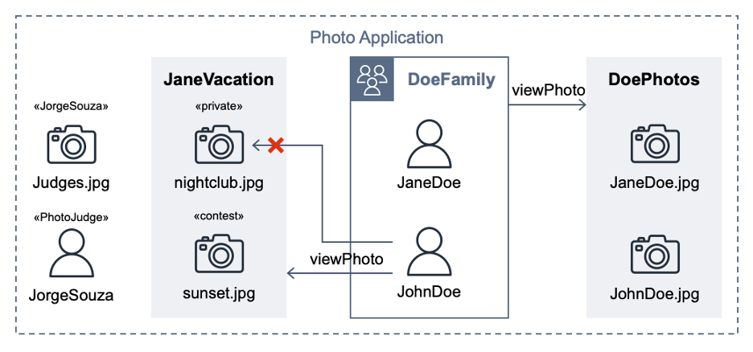

# Automate Cedar policy validation with AWS Developer Tools

[Cedar](https://www.cedarpolicy.com/) is an open-source language that you can use to write policies and make authorization decisions based on those policies. AWS security services including [AWS Verified Access](https://aws.amazon.com/verified-access/) and [Amazon Verified Permissions](https://aws.amazon.com/verified-permissions/) use Cedar to define policies. Cedar supports schema declaration for the structure of entity types in those policies and [policy validation](https://docs.cedarpolicy.com/policies/validation.html) with that schema. The solution outlined in this repository uses [Developer Tools on AWS](https://aws.amazon.com/products/developer-tools/) to implement a build pipeline that validates the Cedar policy files against a schema and runs a suite of tests to isolate the Cedar policy logic.

Read the related AWS Security Blog post ([Automate Cedar policy validation with AWS developer tools](https://aws.amazon.com/blogs/security/automate-cedar-policy-validation-with-aws-developer-tools/)) to see how a subtle policy error that impacts permissions can "break the build" and fail the pipeline execution.

## Scenario

This repository extends a hypothetical photo sharing application from the [Cedar policy language in action](https://catalog.workshops.aws/cedar-policy-language-in-action) workshop. By using that app, users organize their photos into albums and share them with groups of users. Figure 1 shows the entities from the photo application.


Figure 1: Photo Application entities

## Set up the local environment

Start by cloning this repository. Before committing this source code to an AWS CodeCommit repository, run the test suite locally; this can help you shorten the feedback loop. To run the test suite locally, choose one of the following options:

**Option 1**: [Install Rust](https://www.rust-lang.org/tools/install) and compile the Cedar CLI binary

1. Install Rust using the `rustup` tool.

    ```bash
    curl --proto '=https' --tlsv1.2 -sSf https://sh.rustup.rs | sh -s -- -y
    ```

1. Compile the Cedar CLI (version 2.4.2) binary using `cargo`.

    ```bash
    cargo install cedar-policy-cli@2.4.2
    ```

1. Run the `cedar_testrunner.sh` script, which tests authorize requests by using the Cedar CLI.

    ```bash
    cd policystore/tests && ./cedar_testrunner.sh
    ```

**Option 2**: [Run the CodeBuild agent](https://docs.aws.amazon.com/codebuild/latest/userguide/use-codebuild-agent.html#use-codebuild-agent.run-agent)

1. Locally evaluate the `buildspec.yml` inside a CodeBuild container image by using the `codebuild_build.sh` script from [aws-codebuild-docker-images](https://github.com/aws/aws-codebuild-docker-images) with the following parameters:

    ```bash
    ./codebuild_build.sh -i public.ecr.aws/codebuild/amazonlinux2-x86_64-standard:5.0 -a .codebuild
    ```

## Project structure

The `policystore` directory contains one Cedar policy for each `.cedar` file. The Cedar schema is defined the `cedarschema.json` file. A `tests` subdirectory contains a `cedarentities.json` file that represents the application data; its subdirectories (for example, album  `JaneVacation`) represent the test suites. The test suite directories contain individual tests inside their `ALLOW` and `DENY` subdirectories, each with one or more JSON files that contain the authorization request that Cedar will evaluate against the policy set.  A README file in the `tests` directory provides a summary of the test cases in the suite.

The `cedar_testrunner.sh` script runs the Cedar CLI to perform a `validate` command for each `.cedar` file against the Cedar schema, outputting either `PASS` or `ERROR`.  The script also performs an `authorize` command on each test file, outputting either `PASS` or `FAIL` depending on whether the results match the expected authorization decision.

## Set up the CodePipeline

Use AWS CloudFormation to provision the services used in the pipeline.

1. Create a new CloudFormation stack from the template:

    ```bash
    aws cloudformation deploy \    
    --template-file template.yml \    
    --stack-name cedar-policy-validation \    
    --capabilities CAPABILITY_NAMED_IAM
    ```

1. Wait for the message **Successfully created/updated stack**.

## Invoke CodePipeline

Commit the source code to a CodeCommit repository, and then configure and invoke CodePipeline.

1. Add an additional [Git remote](https://git-scm.com/docs/git-remote) named `codecommit` to the repository that you previously cloned. The following command points the Git remote to the CodeCommit repository that CloudFormation created.  The `CedarPolicyRepoCloneUrl` stack output is the HTTPS clone URL.  Replace it with `CedarPolicyRepoCloneGRCUrl` to use the HTTPS (GRC) clone URL when you [connect to AWS CodeCommit with git-remote-codecommit](https://docs.aws.amazon.com/codecommit/latest/userguide/setting-up-git-remote-codecommit.html).

    ```bash
    git remote add codecommit $(aws cloudformation describe-stacks --stack-name cedar-policy-validation --query 'Stacks[0].Outputs[?OutputKey==`CedarPolicyRepoCloneUrl`].OutputValue' --output text)
    ```

1. Push the code to the CodeCommit repository. This starts a pipeline run.

    ```bash
    git push codecommit main
    ```

1. Check the progress of the pipeline run.

    ```bash
    aws codepipeline get-pipeline-execution \
    --pipeline-name cedar-policy-validation \
    --pipeline-execution-id $(aws codepipeline list-pipeline-executions --pipeline-name cedar-policy-validation --query 'pipelineExecutionSummaries[0].pipelineExecutionId' --output text) \
    --query 'pipelineExecution.status' --output text
    ```

The build installs Rust in CodePipeline in your account and compiles the Cedar CLI. After approximately four minutes, the pipeline run status shows **Succeeded**.

## Clean up

To avoid ongoing costs and to clean up the resources that you deployed in your AWS account, complete the following steps:

**To clean up the resources**

1. Open the **Amazon S3** console, select the bucket that begins with the phrase **cedar-policy-validation-codepipelinebucket**, and **Empty** the bucket.
1. Open the **CloudFormation** console, select the **cedar-policy-validation** stack, and then choose **Delete**.
1. Open the **CodeBuild** console, choose **Build History**, filter by `cedar-policy-validation`, select all results, and then choose **Delete builds**.

## Security

See [CONTRIBUTING](CONTRIBUTING.md#security-issue-notifications) for more information.

## License

This library is licensed under the MIT-0 License. See the LICENSE file.
