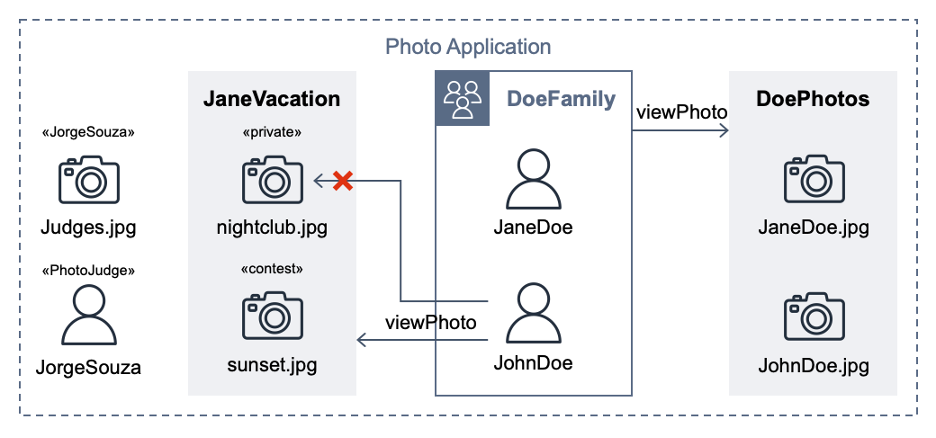

# Stories

Based on the [Full PhotoApp Example](https://catalog.workshops.aws/cedar-policy-language-in-action/en-US/20-tutorial/26-fullexample) requirements from the [Cedar policy language in action](https://catalog.workshops.aws/cedar-policy-language-in-action) workshop, stories are defined using **Given** [initial context], **When** [event occurs], **Then** [ensure some outcomes] language and [Specification by example](https://en.wikipedia.org/wiki/Specification_by_example).



Each story is a folder containing both an ALLOW and DENY subfolder containing test data.  Running `cedar_testrunner.sh` outputs the result to the console and creates a `junitreport.xml` file.

```text
Using cedar-policy-cli 2.4.2

Testing PhotoApp...
 Running validation on temppolicies.cedar and ../cedarschema.json
  ✅ PASS: validate ../DoePhotos.cedar
  ✅ PASS: validate ../JaneVacation.cedar
  ✅ PASS: validate ../Photo-labels-private.cedar
  ✅ PASS: validate ../Photo-owner.cedar
  ✅ PASS: validate ../Photo-subjects.cedar
  ✅ PASS: validate ../PhotoJudge.cedar
  ✅ PASS: validate ../viewPhoto.template.cedar
 Running tests in "Album DoePhotos"
  ✅ PASS: decision "ALLOW" for JaneDoe-view-JohnDoe determined by policy id(s):  DoePhotos;  DoeFamily-DoePhotos
  ✅ PASS: decision "ALLOW" for JohnDoe-view-JaneDoe determined by policy id(s):  DoePhotos;  DoeFamily-DoePhotos
  ✅ PASS: decision "DENY" for JorgeSouza-view-JaneDoe determined by policy id(s):
 Running tests in "Album JaneVacation"
  ✅ PASS: decision "ALLOW" for JaneDoe-view-nightclub determined by policy id(s):  Photo-owner
  ✅ PASS: decision "ALLOW" for JaneDoe-view-sunset determined by policy id(s):  Photo-owner
  ✅ PASS: decision "ALLOW" for JohnDoe-view-sunset determined by policy id(s):  JohnDoe-JaneVacation;  JaneVacation
  ✅ PASS: decision "DENY" for JohnDoe-view-nightclub determined by policy id(s):  Photo-labels-private
 Running tests in "Photo owner"
  ✅ PASS: decision "ALLOW" for JaneDoe-delete-JaneDoe determined by policy id(s):  Photo-owner
  ✅ PASS: decision "ALLOW" for JaneDoe-edit-JaneDoe determined by policy id(s):  Photo-owner
  ✅ PASS: decision "ALLOW" for JaneDoe-view-JaneDoe determined by policy id(s):  DoeFamily-DoePhotos;  Photo-owner;  DoePhotos
  ✅ PASS: decision "ALLOW" for JohnDoe-view-JohnDoe determined by policy id(s):  DoeFamily-DoePhotos;  DoePhotos;  Photo-owner
  ✅ PASS: decision "DENY" for JohnDoe-delete-JaneDoe determined by policy id(s):
  ✅ PASS: decision "DENY" for JohnDoe-edit-JaneDoe determined by policy id(s):
 Running tests in "Role PhotoJudge"
  ✅ PASS: decision "ALLOW" for JorgeSouza-view-sunset-session determined by policy id(s):  PhotoJudge
  ✅ PASS: decision "DENY" for JorgeSouza-view-sunset-nosession determined by policy id(s):
 Running tests in "User JorgeSouza"
  ✅ PASS: decision "ALLOW" for JorgeSouza-view-Judges determined by policy id(s):  Photo-subjects
  ✅ PASS: decision "DENY" for JorgeSouza-view-nightclub determined by policy id(s):  Photo-labels-private
  ✅ PASS: decision "DENY" for JorgeSouza-view-sunset determined by policy id(s):
```

## Album DoePhotos

**Title:** UserGroup DoeFamily has view access to Album DoePhotos

**Given** a `User` in a `UserGroup` \
 **And** a `Photo` in an `Album` \
**When** `Action` viewPhoto is attempted \
 **And** the `Album` permits the `UserGroup`\
**Then** the result should be

Examples:

| result | User       | UserGroup | Photo       | Album     |
|--------|------------|-----------|-------------|-----------|
| ALLOW  | JohnDoe    | DoeFamily | JaneDoe.jpg | DoePhotos |
| ALLOW  | JaneDoe    | DoeFamily | JohnDoe.jpg | DoePhotos |
| DENY   | JorgeSouza |           | JaneDoe.jpg | DoePhotos |

## Photo owner

**Title:** Everyone has view, edit, and delete access to any Photo where they are the owner

**Given** a `User` \
 **And** a `Photo` with an owner \
**When** `Action` viewPhoto, editPhoto, or deletePhoto is attempted \
**Then** the result should be

Examples:

| result | User    | Action      | Photo       | owner   |
|--------|---------|-------------|-------------|---------|
| ALLOW  | JaneDoe | viewPhoto   | JaneDoe.jpg | JaneDoe |
| ALLOW  | JaneDoe | editPhoto   | JaneDoe.jpg | JaneDoe |
| ALLOW  | JaneDoe | deletePhoto | JaneDoe.jpg | JaneDoe |
| ALLOW  | JohnDoe | viewPhoto   | JohnDoe.jpg | JohnDoe |
| DENY   | JohnDoe | editPhoto   | JaneDoe.jpg | JaneDoe |
| DENY   | JohnDoe | deletePhoto | JaneDoe.jpg | JaneDoe |

## Album JaneVacation

**Title:** User JohnDoe has view access to Album JaneVacation, but no one but the owner has access to Photos whose labels include the string "private"

**Given** `User` JohnDoe \
 **And** a `Photo` in `Album` JaneVacation \
**When** `Action` viewPhoto is attempted \
 **And** the `Album` permits `User` JohnDoe \
**Then** the result should be

Examples:

| result | User    | Photo         | Album        | owner   | labels  |
|--------|---------|---------------|--------------|---------|---------|
| ALLOW  | JaneDoe | nightclub.jpg | JaneVacation | JaneDoe | private |
| ALLOW  | JaneDoe | sunset.jpg    | JaneVacation | JaneDoe |         |
| ALLOW  | JohnDoe | sunset.jpg    | JaneVacation | JaneDoe |         |
| DENY   | JohnDoe | nightclub.jpg | JaneVacation | JaneDoe | private |

## Role PhotoJudge

**Title:** Role PhotoJudge has view access to Photos whose labels include the string "contest" **When** in a judgingSession context

**Given** a `User` in a `Role` PhotoJudge \
 **And** a `Photo`'s labels include the string "contest" \
**When** `Action` viewPhoto is attempted \
 **And** in a judgingSession context \
**Then** the result should be

Examples:

| result | User       | judgingSession | Photo      | labels  |
|--------|------------|----------------|------------|---------|
| ALLOW  | JorgeSouza | true           | sunset.jpg | contest |
| DENY   | JorgeSouza | false          | sunset.jpg | contest |

## User JorgeSouza

**Title:** A User has view access to Photos whose optional subjects include their User entity

**Given** a `User` \
 **And** a `Photo`'s subjects include their User entity \
**When** `Action` viewPhoto is attempted \
**Then** the result should be

Examples:

| result | User       | Photo         | subjects   |
|--------|------------|---------------|------------|
| ALLOW  | JorgeSouza | Judges.jpg    | JorgeSouza |
| DENY   | JorgeSouza | nightclub.jpg |            |
| DENY   | JorgeSouza | sunset.jpg    |            |
